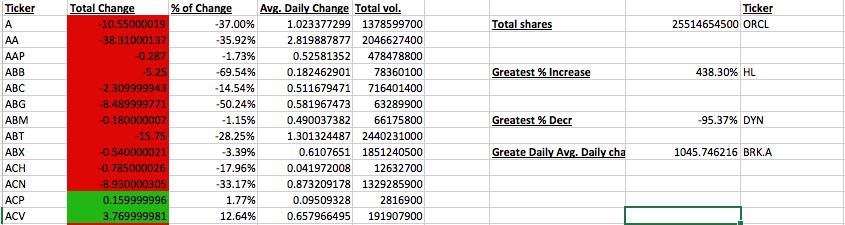

# Unit 2 | Assignment - The VBA of Wall Street

### Background

You are well on your way to becoming a programmer and Excel master! In this homework assignment you will use VBA scripting to analyze a year's worth of real stock market data.

### Stock market analyst

 You are to analyze a year's worth of stock market data. The [2016 Stock Market](Resources/Stock_data_2016.csv) data set has every stock's action for every day the market is open during the year. The data set has seven columns: 'ticker', 'date', 'open', 'high, 'low', 'close' and 'vol'. Each one of those will be used in some capacity.

Your solution should look similar to this image and list out the information for every stock.

Your task is to create a VBA script that does the following:

* Prints the results to a new worksheet

* Prints the following:

  * The ticker symbol in column A

  * Total change in the stock in column B

  * The Percent of change in column C

  * Average Daily change in column D

  * Total volume of trade in column E

* On the same worksheet, the following should also be printed:

  * Greatest Volume, % incr, % decr, and avg. change in column H and the ticker symbol for each in column J.

* The total change in stock should be red if there is a loss and green for a gain.

* Percent change must be formatted into '%' using VBA.

* Headers and labels can be done manually, but anything thing that prints a number or ticker symbol must come from your VBA script.

### Hints and Considerations

* As you will learn with programming, there are multiple solutions for most programs, so don't get discouraged if your answers aren't perfect or like everyone else's.

* Explore the different data types for numbers and try to picture which results will need which type.

* A big part of programming is breaking down your problem into smaller problems and tackling them one at a time.

* After you have broken down your problem into smaller, approachable bytes, write out your strategy for each.

* Start with smaller sample sizes until you get a feel for how the data should respond.

### Submission

* Please use a text editor to create your VBA script and save the file as `StockSolution.vbs`.

* You will only need to upload the StockSolution.vbs file, **NOT** the entire excel file.

### Copyright

Coding Boot Camp © 2016. All Rights Reserved.
